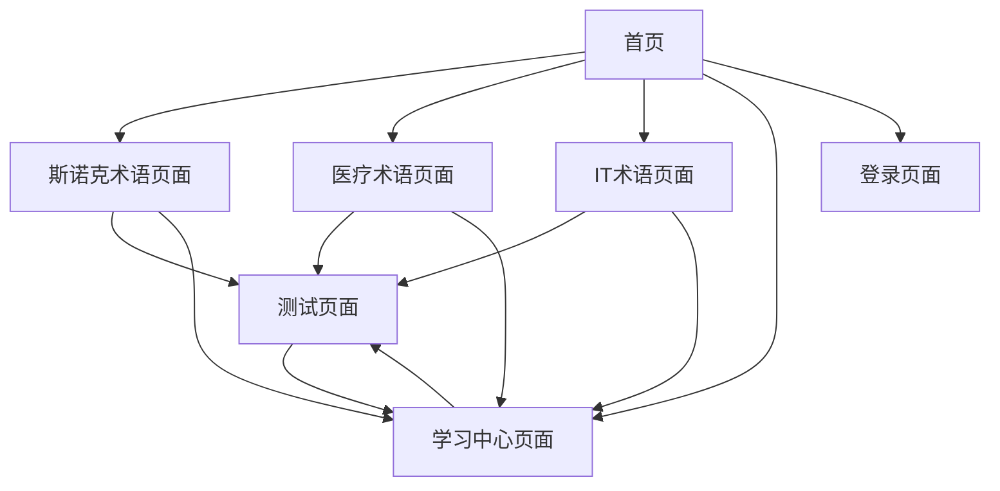

# 英语术语学习系统产品需求文档

## 1. Product Overview

英语术语学习系统是一个基于Vue3的纯前端语音交互学习平台，通过分类术语管理、智能语音朗读和游戏化学习模式，帮助用户高效掌握专业英语术语。

系统面向需要学习专业英语术语的用户群体，解决传统学习方式效率低、发音不准确的问题，通过Web Speech API提供零成本的语音交互体验。

目标是打造一个轻量级、高效的术语学习工具，验证语音交互在教育场景的可行性，为后续产品化奠定基础。

## 2. Core Features

### 2.1 User Roles

| Role | Registration Method | Core Permissions |
|------|---------------------|------------------|
| 默认用户 | 无需注册，直接访问 | 可使用所有学习功能、保存学习进度、收藏术语 |
| 登录用户 | 简单登录（暂不验证） | 与默认用户权限相同，增加个人信息展示 |

### 2.2 Feature Module

我们的英语术语学习系统包含以下主要页面：

1. **首页**：导航菜单、功能介绍、快速入口
2. **斯诺克术语页面**：基于现有HTML的术语学习模块，包含语音控制和学习进度
3. **医疗术语页面**：医疗专业术语学习模块，术语卡片展示和语音朗读
4. **IT术语页面**：信息技术术语学习模块，技术词汇学习和测试
5. **学习中心页面**：个人学习进度、收藏管理、测试记录
6. **测试页面**：游戏化测试功能，选择题和倒计时挑战
7. **登录页面**：用户登录界面（暂不验证）

### 2.3 Page Details

| Page Name | Module Name | Feature description |
|-----------|-------------|---------------------|
| 首页 | 导航菜单 | 显示三个术语分类入口，快速导航到各学习模块 |
| 首页 | 功能介绍 | 展示系统核心功能和使用指南，语音交互演示 |
| 首页 | 学习统计 | 显示总体学习进度和成就徽章 |
| 斯诺克术语页面 | 术语列表 | 展示斯诺克术语卡片，包含英文、中文、分类标签 |
| 斯诺克术语页面 | 语音控制面板 | 语速、音调、音量调节，发音人选择，播放控制 |
| 斯诺克术语页面 | 搜索过滤 | 实时搜索术语，按分类筛选，防抖优化 |
| 斯诺克术语页面 | 学习进度 | 显示学习统计、进度条、掌握程度评级 |
| 医疗术语页面 | 术语卡片 | 医疗专业术语展示，包含音标、例句、发音按钮 |
| 医疗术语页面 | 分类导航 | 按医疗科室和专业领域分类浏览 |
| 医疗术语页面 | 收藏功能 | 收藏重要术语，本地存储同步状态 |
| IT术语页面 | 技术词汇 | IT行业术语展示，编程、网络、数据库等分类 |
| IT术语页面 | 难度分级 | 按初级、中级、高级划分术语难度 |
| IT术语页面 | 语音朗读 | 技术术语标准发音，支持重复播放 |
| 学习中心页面 | 进度统计 | 各模块学习进度可视化，掌握度分析 |
| 学习中心页面 | 收藏管理 | 按分类管理收藏的术语，支持批量操作 |
| 学习中心页面 | 学习记录 | 显示学习历史和时间统计 |
| 测试页面 | 选择题测试 | 随机生成术语释义匹配题，即时反馈 |
| 测试页面 | 倒计时挑战 | 限时答题模式，增加学习趣味性 |
| 测试页面 | 成绩统计 | 测试结果记录和正确率分析 |
| 登录页面 | 登录表单 | 用户名密码输入，暂不进行后端验证 |
| 登录页面 | 用户状态 | 显示登录状态和用户信息 |

## 3. Core Process

**主要用户操作流程：**

用户访问首页 → 选择学习模块（斯诺克/医疗/IT） → 浏览术语列表 → 点击发音按钮学习 → 标记已掌握术语 → 收藏重要术语 → 进入测试页面验证学习效果 → 查看学习中心统计进度。

**语音交互流程：**

用户授权麦克风权限 → 调节语音参数（语速、音调、音量） → 选择发音人 → 单个术语朗读或批量播放 → 语音控制（暂停/继续/停止）。

**学习管理流程：**

术语学习 → 标记学习状态 → 本地存储进度 → 收藏重要术语 → 参与测试 → 查看统计报告 → 调整学习计划。

## 4. User Interface Design

### 4.1 Design Style

- **主色调**：Primary Blue (#165DFF)，Secondary Orange (#FF7D00)
- **中性色**：深灰 (#1D2129)，浅灰 (#F2F3F5)，中灰 (#4E5969)
- **按钮样式**：圆角设计，悬停效果，阴影层次
- **字体**：Inter字体家族，标题18-24px，正文14-16px
- **布局风格**：卡片式设计，顶部导航，响应式网格布局
- **图标风格**：Font Awesome 6.7.2，线性图标为主

### 4.2 Page Design Overview

| Page Name | Module Name | UI Elements |
|-----------|-------------|-------------|
| 首页 | 导航菜单 | 顶部固定导航栏，白色背景，阴影效果，品牌Logo和用户入口 |
| 首页 | 功能介绍 | Hero区域，大标题渐变文字，描述文本居中，最大宽度2xl |
| 首页 | 学习统计 | 三列网格卡片，数字突出显示，悬停动画效果 |
| 斯诺克术语页面 | 语音控制面板 | 左侧固定面板，滑块控件，下拉选择器，按钮组合 |
| 斯诺克术语页面 | 术语列表 | 右侧滚动区域，卡片式布局，标签分类，操作按钮 |
| 医疗术语页面 | 术语卡片 | 响应式网格，图标标识，音标显示，例句折叠 |
| IT术语页面 | 技术词汇 | 代码风格展示，语法高亮，难度标识色彩区分 |
| 学习中心页面 | 进度统计 | 仪表盘样式，环形进度条，彩色图表 |
| 测试页面 | 选择题测试 | 单选按钮样式，选项卡片化，倒计时显示 |
| 登录页面 | 登录表单 | 居中表单，输入框聚焦效果，主色调按钮 |

### 4.3 Responsiveness

系统采用移动优先的响应式设计，使用Tailwind CSS断点系统：
- 移动端（<768px）：单列布局，触摸优化按钮
- 平板端（768px-1024px）：两列布局，适中间距
- 桌面端（>1024px）：三列布局，最佳视觉体验

支持触摸交互优化，按钮最小点击区域44px，适配6英寸以上移动设备。